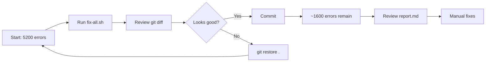

# TypeScript Fixes - Quick Start Guide

## 🚀 One Command to Fix Most Errors

```bash
cd /Users/aideveloper/ai-kit
bash scripts/typescript-fixes/fix-all.sh
```

Choose option **1** (Fix All) from the menu.

---

## 📊 What Gets Fixed

| Fix Type | Errors Fixed | Script |
|----------|--------------|--------|
| 🔧 Config (JSX, Test Types) | ~2,309 (44%) | `01-fix-tsconfig.sh` |
| 📦 Missing Imports | ~854 (16%) | `05-fix-missing-imports.sh` |
| 🧹 Unused Variables | ~306 (6%) | `02-fix-unused-variables.sh` |
| 🌍 process.env Access | ~122 (2%) | `03-fix-process-env.sh` |
| **✅ Total Automatic** | **~3,591 (69%)** | **`fix-all.sh`** |
| 📋 Manual Review Report | ~456 (9%) | `04-fix-undefined-checks.sh` |

**Result:** 5,200 errors → ~1,600 errors (69% reduction!)

---

## ⚡ Quick Commands

```bash
# Fix everything automatically
bash scripts/typescript-fixes/fix-all.sh   # Choose option 1

# Check current error count
npm run type-check 2>&1 | grep -c "error TS"

# Fix just configuration
bash scripts/typescript-fixes/01-fix-tsconfig.sh

# Fix just code quality
bash scripts/typescript-fixes/02-fix-unused-variables.sh
bash scripts/typescript-fixes/03-fix-process-env.sh

# Generate report for manual fixes
bash scripts/typescript-fixes/04-fix-undefined-checks.sh
cat typescript-undefined-report.md

# Review changes
git diff

# Undo if needed
git restore .
```

---

## ✅ Pre-Flight Checklist

- [ ] Working directory is clean (`git status`)
- [ ] On the right branch
- [ ] Committed recent changes
- [ ] Ready to review diffs

---

## 🎯 Expected Timeline

| Step | Time | Command |
|------|------|---------|
| Run all fixes | 2-3 min | `bash scripts/typescript-fixes/fix-all.sh` |
| Review changes | 5-10 min | `git diff` |
| Test builds | 2-3 min | `npm run build` |
| Commit | 1 min | `git commit -am "fix: resolve TS errors"` |
| **Total** | **10-17 min** | |

---

## 🔄 Workflow



---

## 🆘 Quick Troubleshooting

**Problem:** Script won't run
```bash
chmod +x scripts/typescript-fixes/*.sh
```

**Problem:** Too many changes
```bash
# Run one at a time
bash scripts/typescript-fixes/01-fix-tsconfig.sh
git diff  # Review
git commit -am "fix: TS config"
```

**Problem:** Want to undo
```bash
git restore .
```

**Problem:** Need help understanding errors
```bash
cat scripts/typescript-fixes/README.md
```

---

## 📞 Need More Info?

Read the full docs:
```bash
cat scripts/typescript-fixes/README.md
```

---

## 🎉 Success Indicators

After running, you should see:
- ✅ Error count: 5200 → ~1600 (69% reduction)
- ✅ All `.tsx` files compile
- ✅ All test files compile
- ✅ No more JSX errors
- ✅ No more missing import errors
- ✅ Clean unused variable warnings
- ✅ Proper process.env access

**Next:** Review `typescript-undefined-report.md` for remaining manual fixes.
